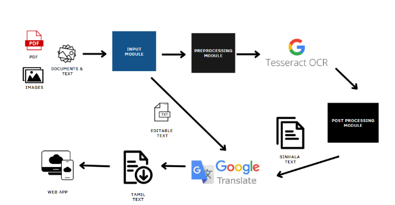

[comment]: # 'This is the standard layout for the project, but you can clean this and use your own template'

# Optical Character Recognition and Translation from Sinhala to Tamil for Printed Documents

#### Team

- E/17/122, Isthikar F.S., [email](mailto:e17122@eng.pdn.ac.lk)
- E/17/153, Karunachandra R.H.I.O., [email](mailto:e17153@eng.pdn.ac.lk)
- E/17/294, Rossmaree D.M., [email](mailto:e17294@eng.pdn.ac.lk)

#### Supervisors

- Prof. Roshan Ragel, [email](mailto:roshanr@eng.pdn.ac.lk)
- Dr. Asitha Bandaranayake, [email](mailto:asithab@eng.pdn.ac.lk)

#### Table of content

1. [Abstract](#abstract)
2. [Related works](#related-works)
3. [Methodology](#methodology)
4. [Experiment Setup and Implementation](#experiment-setup-and-implementation)
5. [Results and Analysis](#results-and-analysis)
6. [Conclusion](#conclusion)
7. [Publications](#publications)
8. [Links](#links)

---

## Abstract
Sinhala and Tamil are the official national languages of Sri Lanka. But most people only speak or read one of them, making a language barrier. This research aims to create an accessible tool to translate Sinhala documents into Tamil language. Optical Character Recognition (OCR) with the underlying technology of Tesseract is used to identify the characters from documents and using Google Translation API, translation is done. Pre-processing and post-processing techniques are used to improve the accuracy of the system.

## Related Works
The area of Sinhala OCR and Sinhala to Tamil translation using different approaches has been touched on earlier by some significant research. However, there is a gap between existing research as there is no proper tool to do the document translations. Find the existing work [here]()

## Methodology

The main objective of this research is to develop a web application system that can convert printed Sinhala documents to Tamil using OCR for various file formats, such as images, documents, PDFs, and texts. This system is open to the public and free of charge. The system consists of 5 main components: Web portal(Input and Output module), preprocessing module, Tesseract OCR, postprocessing module, and Google translate module. Any user may upload a file (image/pdf/text/document) to the system using the web portal. The request is processed using the Restful API. Text and document file types feature editable text, instantly translated using Google Translate and displayed on the web portal. PDFs are first converted into images and then preprocessed using the module to enhance image quality. The main preprocessing techniques used are Binarization and Canny.

- **Binarization:** Converting an image into a binary image that is black and white, depending on a threshold.  
- **Canny:** A text recognition edge detection operator.

The Tesseract OCR extracts the text from the preprocessed images. For text cleaning, we utilized a postprocessing module that eliminates excess spaces, special characters, and other unneeded characters from the text. The Sinhala text is then translated into Tamil using Google Translate, a free Google API that provides highly accurate translations. The web portal displays the final output of the Tamil translation and the intermediate Sinhala OCR.

## Experiment Setup and Implementation

### Experiment Overview

In this research, we used an experiment-based approach to assess our system. The dataset was diverse, including official documents like gazettes and circulars, as well as informal language datasets such as school textbooks and novels to cover different linguistic patterns and potential biases.

The official government website provided original Sinhala documents and their Tamil versions, essential for evaluating the system's Optical Character Recognition (OCR) output and translation accuracy.

The dataset covered a range of file formats, including text and document formats (.txt, .md, .log, .doc, .docx), images (.tif, .tiff, .jpg, .jpeg, .png), and PDFs in various formats.

Our experiment involved:
1. OCR Processing:
    -Applied OCR to extract text from images and scanned PDFs.
2. OCR and Translation Accuracy Assessment:
    -Compared original Sinhala documents with OCR output.
    -Assessed the accuracy of Tamil translations.
3. Output Evaluation:
    -Evaluated the system's output across different document types and linguistic patterns.

### Experiment Phases
The experiment was conducted in three distinct phases to systematically assess the system's performance under varying conditions:

**Phase 1: Tesseract Only**

The initial phase involved using the Tesseract OCR system without any preprocessing. This baseline assessment aimed to understand the system's raw performance without additional enhancements.

**Phase 2: Tesseract with Preprocessing**

In the second phase, the Tesseract OCR system was employed alongside preprocessing techniques. This involved refining the input data before applying OCR to improve the overall accuracy. Preprocessing aimed to enhance the system's ability to extract text from diverse document formats.

**Phase 3: Tesseract with Preprocessing and Post-processing**

The final phase incorporated both preprocessing and additional post-processing steps. Post-processing was introduced to further refine the OCR output, addressing any remaining inaccuracies and optimizing the translation accuracy of the Tamil versions. This comprehensive approach aimed to maximize the system's effectiveness in handling a wide range of document types.

### Evaluation Metrics 

In each phase, OCR accuracy and translation accuracy were calculated using the following equations to analyze and compare the system's performance at different stages of refinement. This approach provided insights into the impact of preprocessing and post-processing on the overall accuracy and efficiency of the OCR and translation processes:

**OCR Accuracy Equation:**

**Translation Accuracy Equation:**

These equations allowed for a quantitative assessment of the system's accuracy in each phase, facilitating a detailed comparison of performance improvements resulting from preprocessing and post-processing interventions.

## Results and Analysis

The chart above illustrates the percentage of correctly detected sentences based on Equation 1. When sentences were processed through Tesseract without any pre-processing mechanisms, approximately 72.68% were successfully converted. This accuracy significantly improved to 85.87% with the incorporation of suggested pre-processing techniques. Further enhancements were achieved by adding post-processing techniques, resulting in an OCR Accuracy of 86.34%.

This means that the system correctly detected 86.34% of the text, subsequently advancing to the translation process. The visual representation provides insights into the impact of pre-processing and post-processing on the overall accuracy of the Optical Character Recognition (OCR) system.

The chart above depicts the percentage of correctly translated sentences based on Equation 2. When sentences were processed through the Google API without any pre-processing mechanisms, nearly 63% of Sinhala sentences were translated accurately. After implementing Canny and Binarization as pre-processing techniques, the translation rate improved significantly to 71.35%.

Further refinements were achieved through post-processing, involving the removal of unwanted characters, leading to a translation accuracy of 72.52%. It's noteworthy that 17% of the inaccuracies in Sinhala performance resulted from the unavailability of appropriate source words and symbols in the API, as well as grammatical mistakes in the APIs.

These findings suggest that there is room for improvement in API capabilities. The ongoing enhancement of APIs holds the potential to further improve translation accuracy and address the challenges identified in the current evaluation.

## Conclusion
At the end of the research, we were able to develop a tool that is accessible to a diverse user base which enables the translation of Sinhala documents in different formats into editable Tamil texts thereby overcoming linguistic barriers. The system's optical character recognition (OCR) accuracy rate was 85%, and its translation accuracy rate was 77%. These were observed after utilizing pre-processing and post-processing techniques.

This tool may lead to further growth in future such as bringing out more reliability, accuracy and modification of the tool to support different other languages. As well as the research can be extended to overcome further related issues. A significant impact can be made in society through this as it allows people to get information and knowledge in their native language. It will interconnect the world and keep individuals informed and allied regardless of their linguistic aspects.

[//]: # 'Note: Uncomment each once you uploaded the files to the repository'

<!-- 1. [Semester 7 report](./) -->
<!-- 2. [Semester 7 slides](./) -->
<!-- 3. [Semester 8 report](./) -->
<!-- 4. [Semester 8 slides](./) -->
<!-- 5. Author 1, Author 2 and Author 3 "Research paper title" (2021). [PDF](./). -->

## Links

[//]: # ' NOTE: EDIT THIS LINKS WITH YOUR REPO DETAILS '

- [Project Repository](https://github.com/cepdnaclk/e17-4yp-OCR-and-Translation-from-Sinhala-to-Tamil-for-Printed-Documents)
- [Project Page](https://cepdnaclk.github.io/e17-4yp-OCR-and-Translation-from-Sinhala-to-Tamil-for-Printed-Documents/)
- [Department of Computer Engineering](http://www.ce.pdn.ac.lk/)
- [University of Peradeniya](https://eng.pdn.ac.lk/)
- [Download the Research Paper]()

[//]: # 'Please refer this to learn more about Markdown syntax'
[//]: # 'https://github.com/adam-p/markdown-here/wiki/Markdown-Cheatsheet'
